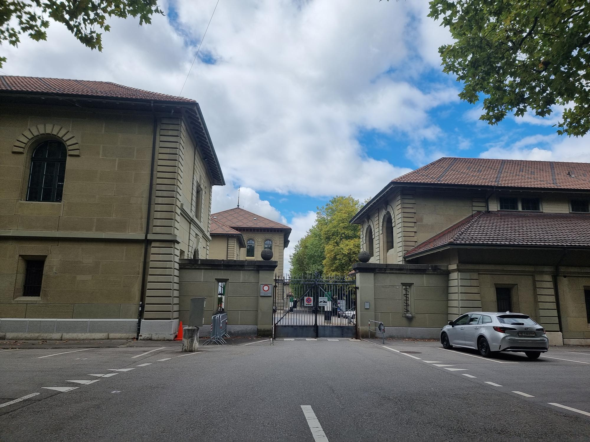

+++
title = "Sollten gleiche Rechte auch gleiche Pflichten bedeuten?"
date = "2022-11-18"
draft = true
pinned = false
description = "Wer ins Militär geht, kann sich auf wochenlange Trainings, das Tragen von schwerem Gepäck und wenig Schlaf gefasst machen. Dabei erwartet Frauen dasselbe wie Männer. Der einzige Unterschied gilt bei der Pflicht. Männer müssen nach ihrem 18. Lebensjahr den Militär- oder Zivildienst leisten, während es für Frauen freiwillig ist. \nDie Teilnahme an einem Orientierungstag exklusiv für Frauen und ein Gespräch mit Oberleutnant Fabienne Walser bringen uns dem Leben einer Frau im Militär näher. \n\n"
+++
##### Wer ins Militär geht, kann sich auf wochenlange Trainings, das Tragen von schwerem Gepäck und wenig Schlaf gefasst machen. Dabei erwartet Frauen dasselbe wie Männer. Der einzige Unterschied gilt bei der Pflicht. Männer müssen nach ihrem 18. Lebensjahr den Militär- oder Zivildienst leisten, während es für Frauen freiwillig ist.

##### Die Teilnahme an einem Orientierungstag exklusiv für Frauen und ein Gespräch mit Oberleutnant Fabienne Walser bringen uns dem Leben einer Frau im Militär näher.

### Anpassungsfähigkeit ist wichtig

Es ist ein Samstagmorgen, als wir uns am Bahnhof Bern treffen, um gemeinsam bis zur Haltestelle Guisanplatz Expo zu fahren. Wir halten beide ein «Aufgebot» als Gratisbillett in der Hand, welches wir nach der Anmeldung per Post erhalten haben. Damit dürfen wir heute den ganzen Tag den ÖV im Kanton Bern benutzen. Wir sind nämlich auf dem Weg zu einem Orientierungstag des Schweizer Militärs, der exklusiv für Frauen ist. Schon aufgeregt steigen wir in das Tram und lesen noch einmal das Programm für den Tag durch. Beim Guisanplatz angekommen, müssen wir noch eine kurze Strecke laufen und schon stehen wir vor dem Amt für Bevölkerungsschutz, Sport und Militär Bern. Das Tor steht weit offen und wir betreten das Areal. Zielstrebig laufen wir auf die Mannschaftskaserne zu, vor der ein paar uniformierte Personen stehen. Sie zeigen uns den Weg in das Gebäude, wo uns eine Frau erwartet und schon das Anmeldeformular für die Rekrutierung und andere Broschüren austeilt. Mit Informationsmaterial ausgerüstet begeben wir uns in einen Raum, in dem die anderen Teilnehmerinnen bereits ihren Platz gefunden haben und gespannt auf die Einführung warten. Kaum haben wir uns gesetzt, beginnt schon der Anlass. Zuerst wird eine Vorstellungsrunde gemacht und danach bekommen wir die verschiedenen Teams und Funktionen der Armee vorgestellt.

Kurz vor der Pause geht die Tür des Raumes auf und eine Frau in Uniform kommt herein. Diese stellt sich als Fabienne Walser, Oberleutnant im Bereich Sanität, vor. Sie ist direkt nach einem einwöchigen Wiederholungskurs an diesen Anlass gekommen und scheint in der vergangenen Nacht reichlich wenig Schlaf bekommen zu haben. Für die Pause wurde draussen schon ein «Znüni»-Buffet vorbereitet. Währenddem wir ein «Gipfeli» essen, lesen wir die vielen Flyer durch, in denen junge Frauen abgebildet sind und von ihrer Zeit im Militär berichten. Am Anlass wird oft betont, dass im Militär alle gleichbehandelt werden. Auch Frau Walser bestätigt uns später, dass, wenn man sich anpassen könne, die Regeln befolge und das bringe, was verlangt wird, niemand bevorzugt oder vernachlässigt werde. Es sei nicht korrekt, jemanden, egal welche Hautfarbe oder Geschlecht, anders zu behandeln. Man könne nicht mal anhand der Kleider unterschieden werden, weil alle in der gleichen Uniform sind.

### Ausbildungen und Neues ausprobieren

Was motiviert Frauen freiwillig den Militärdienst zu machen? Schliesslich verpflichten sie sich dazu, eine 18-wöchige Grundausbildung zu absolvieren. Während dieser können sie nur an den Wochenenden nach Hause gehen.  Danach müssen sie jährlich Wiederholungskurse von je 19 Tagen besuchen oder entscheiden sich für das Durchdienermodell, bei dem sie ihre gesamte Dienstzeit bei der Armee am Stück absolvieren.

Wir haben festgestellt, dass die Motive dafür, den Militärdienst zu leisten, sehr unterschiedlich sind. Manche der Teilnehmerinnen des Orientierungstages sagen, sie hätten schon seit Langem gewusst, dass sie einmal in die Rekrutenschule gehen würden. Andere sind noch unentschieden und sind gekommen, um mehr über die Rekrutierung zu erfahren. Einige erklären auch, dass sie einen Ausgleich zu ihrem Leben bisher suchen und etwas Neues ausprobieren möchten, um aus ihrer Komfortzone zu kommen. Man könne auch seine Fähigkeiten in gewissen Bereichen stärken, erzählt Frau Walser. Ausserdem sei es für sie im zivilen Leben etwas wert, im Militär gewesen zu sein, weil sie Diplome mitnehmen konnte, die anerkannt werden.

### Alle müssen die gleiche Leistung erbringen

«Ich musste zeigen, dass ich das Gleiche kann; genauso schwer tragen, viel laufen, viel essen, wenig schlafen wie sie *(die männlichen Kollegen).* Nach zwei Wochen haben sie gemerkt, dass ich dieselbe Leistung erbringe, mich akzeptiert und mir geholfen.» Das antwortet Frau Walser auf die Frage, ob sie sich schnell in das Kollektiv habe integrieren können. Sie sagt, sie habe sich in den ersten zwei Wochen noch bei den Männern beweisen müssen. Hätte sie immer gejammert, hätte sie nicht den Anschluss gefunden. Sie wäre nur ein Störfaktor gewesen, und das, obwohl sie sich freiwillig angemeldet hatte.

Damit es nicht zu Fällen von Überbelastung und gar Abbruch des Dienstes kommt, müssen alle Rekruten einen Sporttest absolvieren. Je nachdem, welche Punktzahl sie dabei erreichen, werden sie für gewisse Funktionen bei der Armee zugelassen. Die Bewertung funktioniert für alle gleich, auch zwischen Frauen und Männern wird nicht unterschieden, denn am Ende müssen alle dieselbe Leistung erbringen. Alle müssen die gleiche Ausrüstung tragen und dieselben Aufgaben erfüllen können.

### Zwischen Freiwilligkeit und Obligation

Nun haben wir bereits einen guten Einblick in das bekommen, was einen nach einer Anmeldung für die Rekrutierung erwarten könnte. Wie der Rekrutierungsprozess für die Frauen genau funktioniert, erklärt uns der Kommandant des Rekrutierungszentrums Sumiswald (BE), Oberst i Gst Martin Gafner. Dieser Prozess ist für Frauen und Männer unterschiedlich. Wenn Männer sich für die Rekrutierung angemeldet haben, sind sie schon dazu verpflichtet, den Dienst zu leisten. Frauen hingegen verpflichten sich erst, wenn sie, nachdem sie an der Aushebung waren (Einteilung eines zukünftigen Rekruten in eine Funktion), den Vertrag unterschreiben. Der Rekrutierungsprozess ist unterschiedlich, weil Frauen sich freiwillig dafür entscheiden und Männer entweder den Militär- oder Zivildienst leisten und sonst Ersatzzahlungen machen müssen. Ebenfalls ist die Teilnahme an einem Orientierungstag für volljährige Männer obligatorisch, während sie für Frauen freiwillig ist. Frau Walser fände es gut, wenn wenigstens der Orientierungstag für alle obligatorisch wäre. «Viele nehmen diesen Orientierungstag gar nicht wahr und werfen den Zettel mit der Einladung direkt ins Altpapier», sagt sie. Sie sei auch nicht anders gewesen. Mit 18 habe sie den Brief aufgemacht und sich gedacht, wenn sie nicht aufgrund ihres Vaters so nahe mit dem Militär aufgewachsen wäre, hätte sie nur den Titel gelesen und den Brief weggeworfen. Man höre auch viele Schauermärchen, weil jeder erzähle, dass seine Rekrutenschule die Schlimmste gewesen sei. Dabei werde immer noch etwas zu der Geschichte dazu gedichtet. Ihrer Meinung nach sei es am besten, wenn man die Chance wahrnehme und sich ein eigenes Bild machen könne. Ausserdem wäre es korrekt, wenn es für alle eine Wehrpflicht gäbe. Sie erklärt: «Eine Frau kann auch einen Beitrag leisten und wenn nicht, muss sie auch nicht die anderen Ansprüche von Gerechtigkeit verlangen. Es ist wie eine Waage. Ich verlange etwas und gebe etwas zurück. \[…] Wir wollen Gleichberechtigung beim Job, Lohn, Kaderstellen, Steuern, die gleichen Rechte haben. Wieso sollten wir nicht auch dort gleichberechtigt sein und als Frau auch etwas unserem Land zurückgeben?»

### Nach dem Essen wird Sport gemacht

Ungefähr um 12 Uhr begibt sich unsere Gruppe in ein anderes Gebäude, in dem schon das Mittagessen auf uns wartet. Es gibt Salat, Pasta und sogar ein Dessert. Zwischen dem Mittagessen und dem Znüni können wir sagen, dass wenn das Essen der Rekrutenschule genauso gut schmeckt wie an diesem Tag, sich auf jeden Fall keiner darüber beklagen kann.

Gestärkt gehen wir nun zurück in einen Raum, wo schon ein «Marktplatz» vorbereitet ist. Er besteht aus einer Materialausstellung und informativen Postern zu den Teams der Armee wie auch den Anforderungsprofilen der Funktionen. An einem der Stände können wir sogar verschiedenste Militärausrüstungen anprobieren. Zum Schluss dürfen wir den Sporttest machen, der bestimmt, für welche Funktion jemand zugelassen wird. Zu diesem Test gehören der Standweitsprung, Medizinballstoss, Einbeinstand, Rumpfkrafttest und progressive Ausdauerlauf. Dadurch bekommen wir eine Kostprobe dafür, welche körperlichen Anstrengungen der Militärdienst mit sich bringt, denn bei einem Grossteil der Disziplinen werden wir als knapp genügend eingeteilt. Falls wir uns dazu entscheiden, ins Militär zu gehen, werden wir wohl keine Militärpolizistinnen oder Grenadiere. Das sind nämlich von den Funktionen mit den höchsten Anforderungsprofilen.

Im Grossen und Ganzen war der heutige Tag ein Erfolg. Wir haben viel über das Militärleben einer Frau gelernt, haben einen Einblick in die verschiedenen Truppen der Armee bekommen und haben erfahren, wie der Anmeldeprozess abläuft. Wenn wir uns für die Rekrutierung anmelden wollen, haben wir alle Informationen, die wir benötigen. Wir haben sogar das Anmeldeformular, welches uns schon zu Beginn des Orientierungstages gegeben wurde und sind somit bestens vorbereitet.